# Evidencia de la semana · GitHub Copilot

| 👤 Alumno | 🔗 Repositorio |
| :--- | :--- | 
| **Julian Padron Nuñez** | [`juliannp253/taskflow-copilot-juliannp253`](https://github.com/juliannp253/taskflow-copilot-juliannp253)|


---

## 📌 Día 1 · La CLI

### ¿Qué construí?

Con las prácticas llevadas a cabo esta semana empecé a familiarizarme con el uso de **Copilot mediante la CLI** y ver de lo que es capaz de hacer al abrir el agente dentro de un proyecto.

Al abrir el agente dentro de uno de nuestros proyectos, este es capaz de **leer, buscar, editar, o eliminar archivos** (según nuestros permisos) para poder contestar a preguntas que le hagamos o realizar tareas que le designemos dentro del proyecto.

| 🔎 Diagnóstico de contenido del repo | ❓ Comprobación de endpoints |
| :---: | :---: |
| 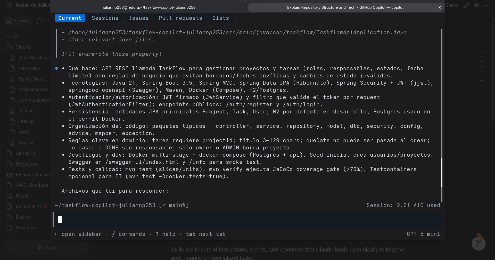 | 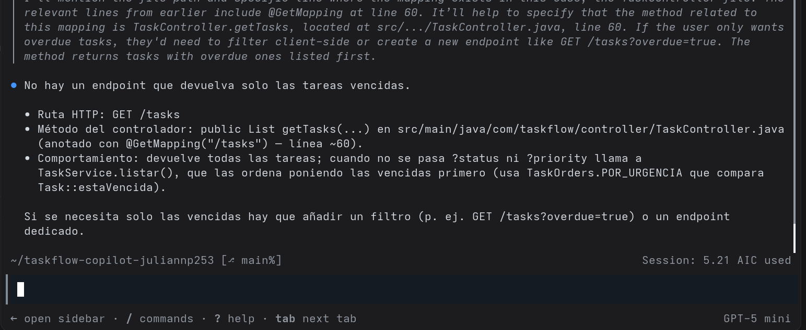 |
| *Respuesta del agente sobre la estructura y contenido del proyecto* | *Validación del agente ante la consulta de un endpoint inexistente* |

#### ⚡ Ejecución de comandos y permisos

En cuestión de comandos, un agente es capaz de ejecutar los comandos en la terminal siempre que se lo autoricemos. Para la ejecución de un comando, Copilot siempre nos pide una autorización en la cual podemos:
- **Aprobar una vez**
- **Aprobar siempre**
- **Denegar** la ejecución de dicho comando

> **Prompt ejecutado en terminal:**
> ```bash
> Corre mvn -q test y dime solo si terminó bien o con error.
> ```

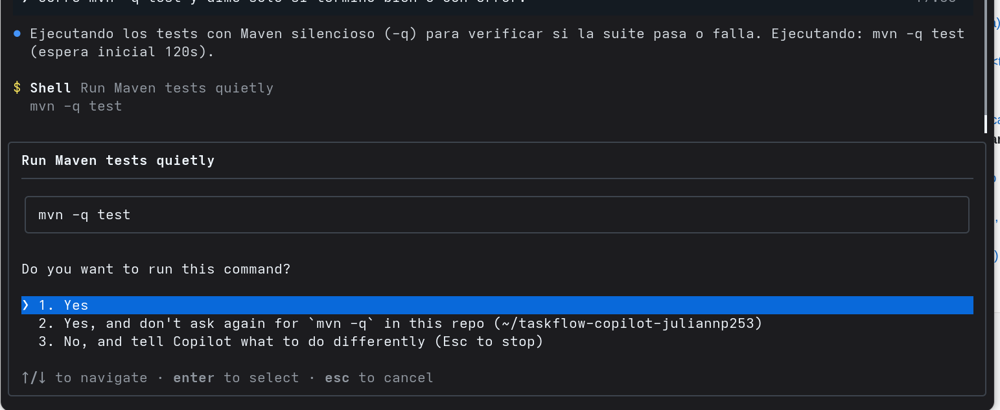
*Solicitud interactiva de confirmación de permisos en la CLI de Copilot antes de correr pruebas.*

### ¿Dónde está?

Los entregables y archivos modificados correspondientes a este día son:
- [`📁 .github/copilot-instructions.md`](.github/copilot-instructions.md)
- [`📄 docs/ARQUITECTURA.md`](docs/ARQUITECTURA.md)

Aquí podemos encontrar el resultado de la ejecución del siguiente prompt:

> **Prompt utilizado para generar la documentación de arquitectura:**
> ```text
> Escribe el archivo docs/ARQUITECTURA.md para un desarrollador que llega nuevo a TaskFlow. Explica: las capas y paquetes; el recorrido completo de POST /projects/{projectId}/tasks desde el controlador hasta la base de datos; dónde viven las reglas de negocio; cómo funciona la seguridad con JWT; y cómo están organizados los tests. Escribe entre backticks cada clase del proyecto (por ejemplo `TaskService`) y cada archivo con su ruta desde la raíz del repositorio (por ejemplo `src/main/java/com/taskflow/model/Task.java`). No modifiques ningún otro archivo.
> ```


### ¿Cómo se comprueba?

> - **Archivo de comprobación:** [`evidencia/dia1/verificador.txt`](evidencia/dia1/verificador.txt)
> - **Criterio de validación:** La última línea debe contener `0 NO EXISTE`.
> - **Resultado verificado:** `Resumen: 66 OK · 3 REVISA · 0 EXTERNA · 0 NO EXISTE · 19 sin verificar`


### ¿Qué no salió?

> **Nada** (todos los ejercicios y comandos se ejecutaron exitosamente sin errores).

---

## 📌 Día 2 · Especificar, implementar y revisar

### ¿Qué construí? 

Este día el agente empezó a escribir código, en específico dos endpoints nuevos para la API de TaskFlow, **GET /tasks/overdue** y **GET /tasks/unassigned**, con sus tests correspondientes. Para llevar a cabo estas implementaciones, proporcioné especifícaciones de cómo debería de implementar las nuevas funcionalidades (**specs/overdue.md** y **specs/unassigned.md**), el agente las lee y ahora restringimos a que siga nuestro procedimiento y evitamos que tome sus propias decisiones.

#### 🔹 1. Implementación de `GET /tasks/overdue`

> **Prompt ejecutado en terminal:**
> ```bash
> Implementa la especificación de specs/overdue.md al pie de la letra. Cuando termines, corre mvn -q test y confirma que pasa.
> ```

| 📖 Lectura de Spec y Búsqueda | ✏️ Modificación de `TaskController` | 🧪 Validación con `mvn -q test` |
| :---: | :---: | :---: |
| 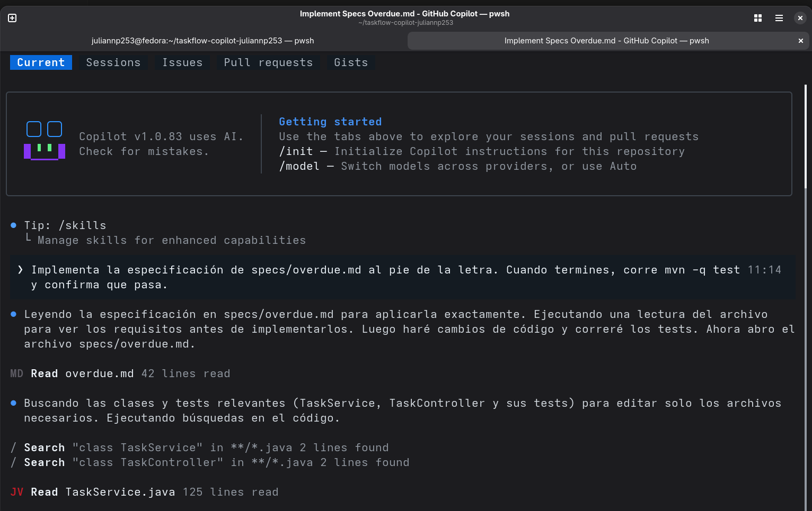 | 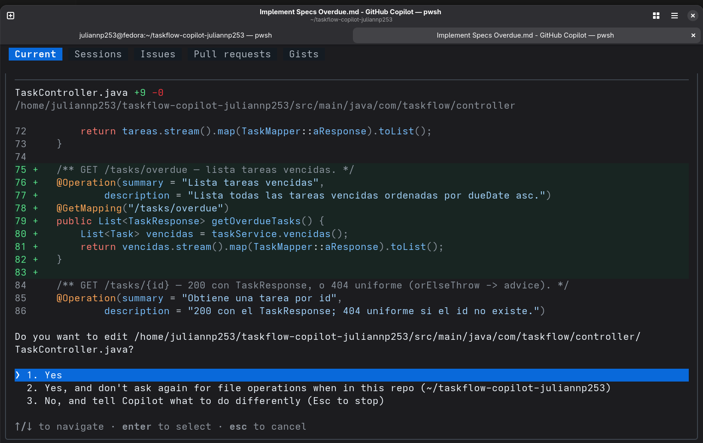 | 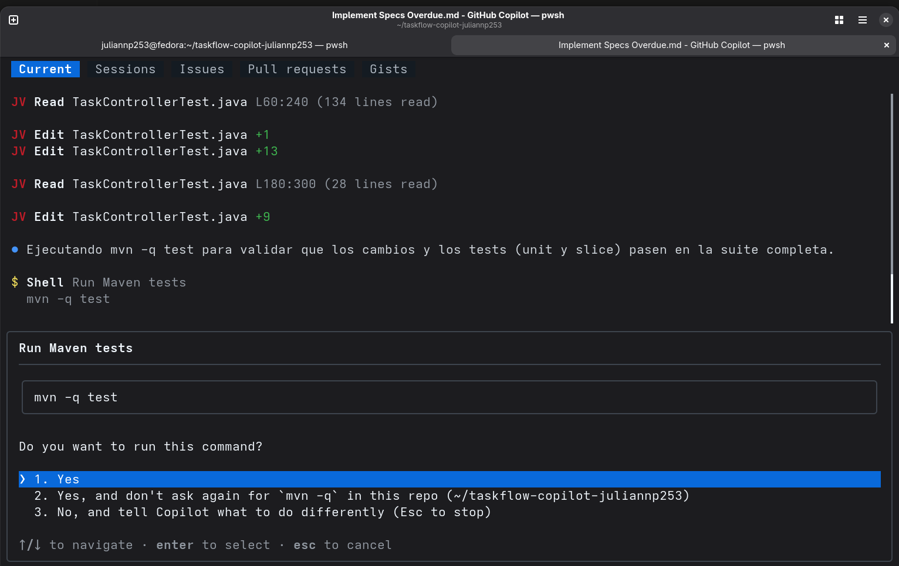 |
| *Copilot lee `specs/overdue.md` e inspecciona archivos* | *Confirmación de cambios para el endpoint en el controlador* | *Ejecución de la suite de tests para asegurar que todo pasa* |

#### 🔹 2. Implementación de `GET /tasks/unassigned` mediante `/plan`

> **Prompt ejecutado en terminal:**
> ```bash
> /plan Implementa la especificación de specs/unassigned.md al pie de la letra. Cuando termines, corre mvn -q test y confirma que pasa.
> ```

| 🎯 Ejecución del comando `/plan` | 📋 Plan detallado generado por el agente |
| :---: | :---: |
| 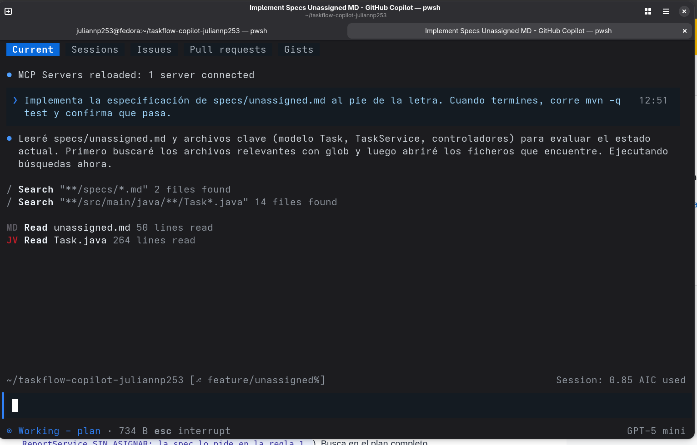 | 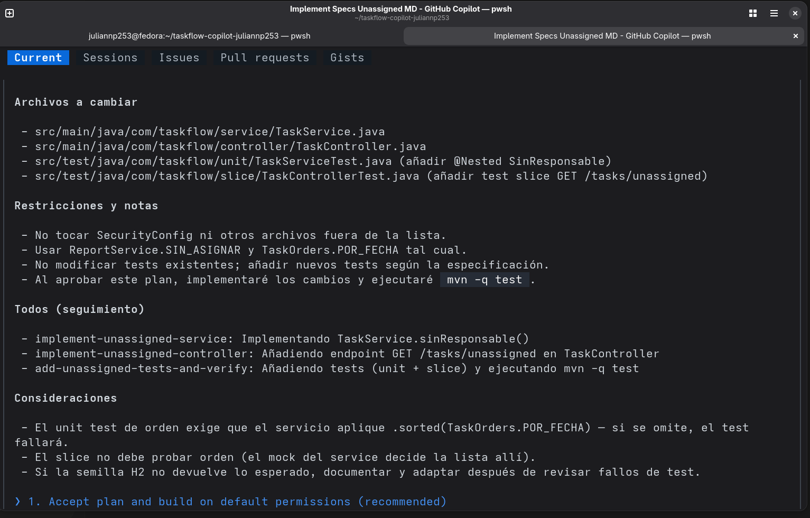 |
| *Instrucción para generar plan de trabajo antes de editar código* | *Revisión de archivos a cambiar, restricciones y tareas pendientes* |

### ¿Dónde está? 

Los archivos desarrollados, especificaciones y Pull Request correspondientes a este día son:

- **Especificaciones:**
  - [`📄 specs/overdue.md`](specs/overdue.md)
  - [`📄 specs/unassigned.md`](specs/unassigned.md)
- **Controlador y Servicio (Lógica de negocio):**
  - [`☕ src/main/java/com/taskflow/controller/TaskController.java`](src/main/java/com/taskflow/controller/TaskController.java) (endpoints `GET /tasks/overdue` y `GET /tasks/unassigned`)
  - [`☕ src/main/java/com/taskflow/service/TaskService.java`](src/main/java/com/taskflow/service/TaskService.java) (métodos `vencidas()` y `sinResponsable()`)
- **Tests unitarios y de integración:**
  - [`🧪 src/test/java/com/taskflow/unit/TaskServiceTest.java`](src/test/java/com/taskflow/unit/TaskServiceTest.java) (pruebas unitarias de ordenamiento y filtrado, incluyendo `@Nested SinResponsable`)
  - [`🧪 src/test/java/com/taskflow/slice/TaskControllerTest.java`](src/test/java/com/taskflow/slice/TaskControllerTest.java) (pruebas MockMvc de respuesta `200` y DTOs)
- **Pull Request en GitHub:**
  - [`🔗 Pull Request #1`](https://github.com/juliannp253/taskflow-copilot-juliannp253/pull/1) (registrado en [`evidencia/dia2/pr.txt`](evidencia/dia2/pr.txt))

### ¿Cómo se comprueba? 

> - **Pruebas de mutación (verificación de efectividad de tests):**
>   - [`evidencia/dia2/checklist-overdue.txt`](evidencia/dia2/checklist-overdue.txt): Se introdujo un mutante eliminando `.sorted(TaskOrders.POR_FECHA)` en `vencidas()`, provocando fallo inmediato (`[ERROR] Tests run: 8, Failures: 1`). Tras restaurarlo, la suite pasó limpia (`69 tests, 0 failures`).
>   - [`evidencia/dia2/verificador.txt`](evidencia/dia2/verificador.txt): Se quitó `.sorted(TaskOrders.POR_FECHA)` en `sinResponsable()`, detectándose el fallo esperado (`[ERROR] Tests run: 10, Failures: 1, BUILD FAILURE`).
> - **Suite completa de pruebas en `main`:**
>   - [`evidencia/dia2/suite-main.txt`](evidencia/dia2/suite-main.txt): `[INFO] Tests run: 72, Failures: 0, Errors: 0, Skipped: 0` (`BUILD SUCCESS`).
> - **Comprobación manual de endpoints (Semilla H2):**
>   - [`evidencia/dia2/comprobacion.txt`](evidencia/dia2/comprobacion.txt):
>     - `GET /tasks/overdue` ➜ tarea con ID `7` («Corregir bug de fechas», `IN_PROGRESS`).
>     - `GET /tasks/unassigned` ➜ tareas con ID `4, 6` en orden por fecha.
>     - Solicitud sin token ➜ respuesta HTTP `401`.

### ¿Qué no salió? 

Se realizó un primer intento de implementación de **specs/unassigned.md** en donde al pedirle al agente que nos generé un **/plan** previo a implementar el código, sugerí los siguientes cambios en el plan:

> ```text
> El plan no dice qué casos usa el test unit de orden. La spec los pide: el repositorio devuelve, en este orden, una sin responsable con fecha en 10 días, una con responsable, una sin responsable sin fecha y una sin responsable con fecha en 2 días; sinResponsable() devuelve las tres sin responsable en el orden 2 días, 10 días, sin fecha, comparando los ids en orden. Agrégalo al plan.
> ```

---

## 📌 Día 3 · MCP

### ¿Qué construí? 

Model Context Protocol nos permite el conectarle **herramientas** a nuestro agente. En este día le conecté la herramienta del servidor de GitHub para que pudiera abrir un issue en mi repositorio, el de documentación de AWS, y la de Playwright para poder realizar UI tests de TaskFlow. Extra a esto, creé una extra escrita en Java para que el agente pueda hablar con la API.

#### 🔹 1. Interacción con el servidor MCP de GitHub (Creación de Issue)

> **Prompt ejecutado en terminal:**
> ```text
> Usa el servidor MCP de GitHub para crear un issue en el repositorio juliannp253/taskflow-copilot-juliannp253. Título exacto: GET /projects/{id}/summary. Cuerpo: el contenido del archivo issues/summary.md tal cual, sin resumirlo ni cambiarlo. No uses la terminal. Al terminar dime el número del issue y su URL.
> ```

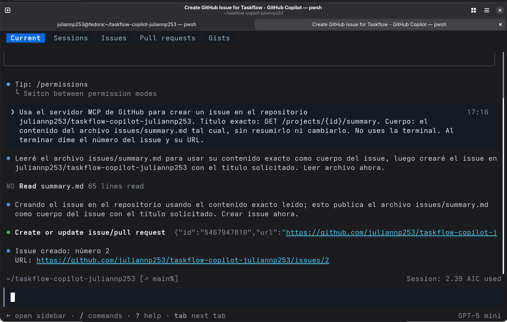
*Copilot hace uso del servidor MCP de GitHub para crear el issue #2 con la especificación de resumen del proyecto.*

#### 🔹 2. Configuración y registro de servidores MCP

Se añadieron y habilitaron servidores MCP locales y remotos para dotar al agente de nuevas capacidades:

| 🎭 Playwright (UI Testing) | ☕ TaskFlow (API local en Java) | ☁️ AWS Knowledge (Catálogo en la nube) |
| :---: | :---: | :---: |
| 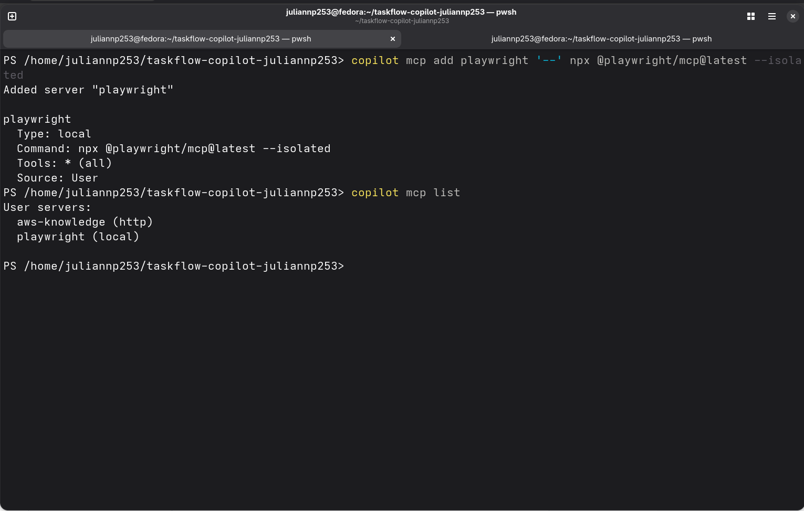 | 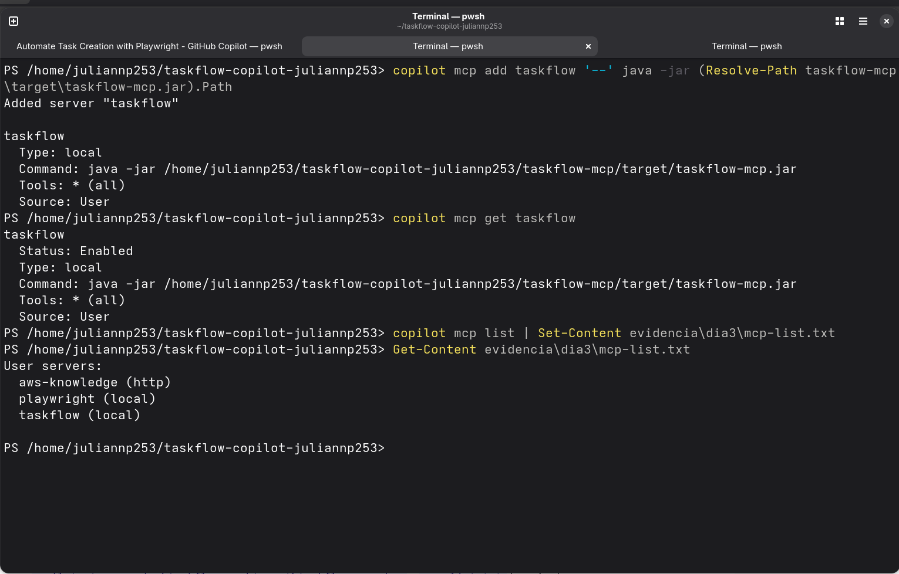 | 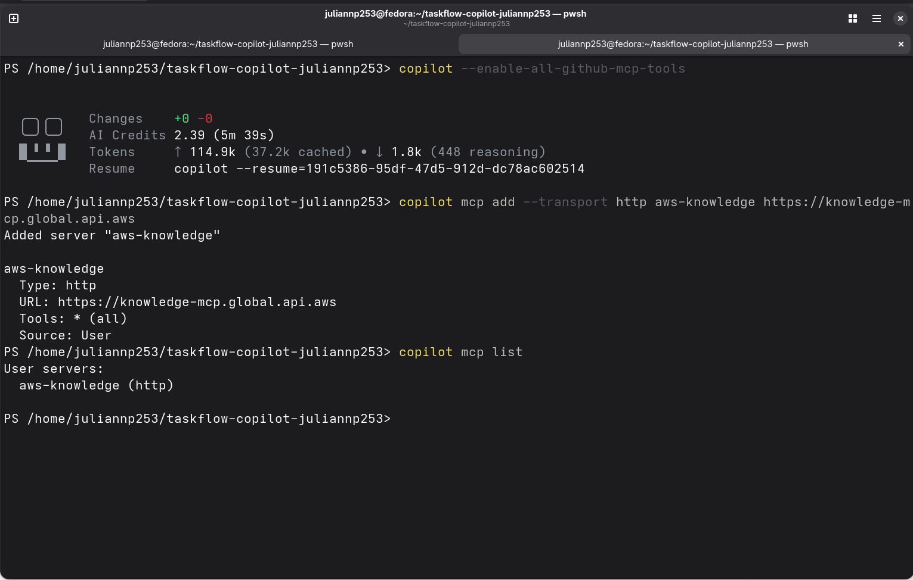 |
| *Comando: `npx @playwright/mcp@latest --isolated`* | *Comando: `java -jar taskflow-mcp.jar`* | *Transporte HTTP: `knowledge-mcp.global.api.aws`* |

> Comprobamos que cada servidor MCP aparezca disponible y habilitado en Copilot:
> ```bash
> copilot mcp list
> ```

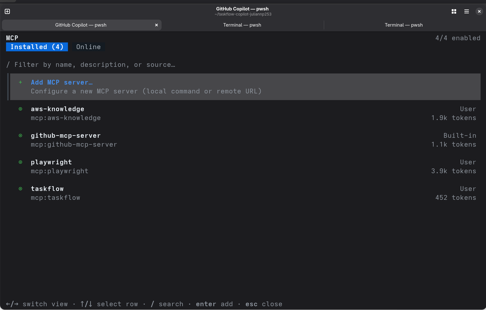
*Verificación en el panel de Copilot: 4 servidores conectados y activos (`aws-knowledge`, `github-mcp-server`, `playwright`, `taskflow`).*

#### 🔹 3. Flujo integrador: Tareas vencidas a Issues de GitHub

Con la combinación del servidor MCP de GitHub y el de TaskFlow, el agente pudo consultar tareas en la API y abrir issues automáticamente por cada tarea vencida detectada.

> **Prompt integrador:**
> ```text
> Usa el servidor MCP taskflow para listar las tareas vencidas. Por cada tarea vencida crea un issue en el repositorio juliannp253/taskflow-copilot-juliannp253 con el servidor MCP de GitHub. Título: Tarea vencida #<id>: <título de la tarea>. Cuerpo: proyecto, prioridad, estado, fecha límite y descripción de la tarea. No uses la terminal. Al final dime cuántos issues creaste.
> ```

| 🚀 Inicio de sesión y consulta a TaskFlow | 🎯 Resolución de proyecto y creación de Issue |
| :---: | :---: |
| 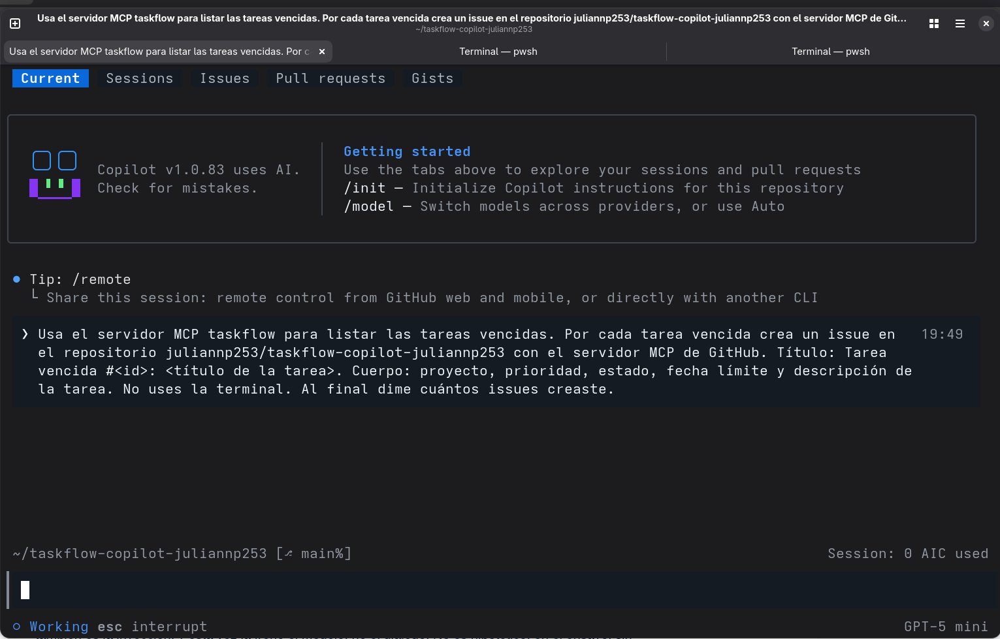 | 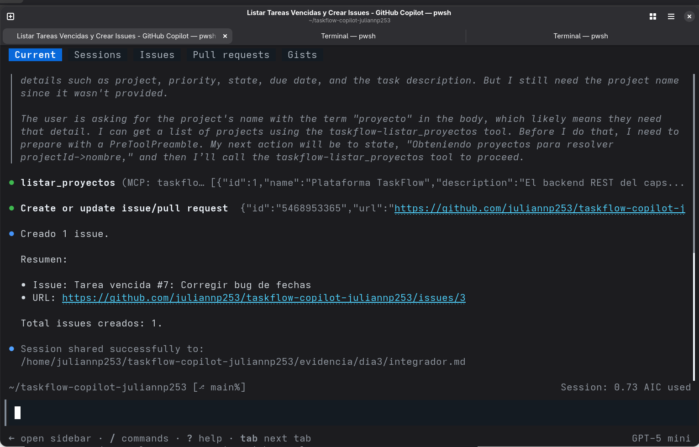 |
| *El agente recibe el prompt y consulta `taskflow-listar_tareas_vencidas`* | *El agente resuelve el nombre del proyecto y crea el issue #3 en GitHub* |

### ¿Dónde está? 

Los recursos desarrollados, configuraciones y evidencias de las sesiones correspondientes a este día son:

- **Servidor MCP Custom de TaskFlow (Java):**
  - [`📁 taskflow-mcp/`](taskflow-mcp/) — Proyecto Maven completo del servidor MCP.
  - [`📦 taskflow-mcp/target/taskflow-mcp.jar`](taskflow-mcp/target/taskflow-mcp.jar) — Artefacto ejecutable del servidor local.
  - [`☕ taskflow-mcp/src/main/java/com/taskflow/mcp/TaskflowTools.java`](taskflow-mcp/src/main/java/com/taskflow/mcp/TaskflowTools.java) — Implementación de las herramientas MCP (`listar_tareas_vencidas`, `listar_proyectos`, etc.).
- **Sesiones exportadas y especificaciones:**
  - [`📄 specs/summary.md`](specs/summary.md) — Especificación utilizada para el cuerpo del issue #2.
  - [`📄 evidencia/dia3/integrador.md`](evidencia/dia3/integrador.md) — Transcripción completa de la sesión integradora (TaskFlow + GitHub).
  - [`📄 evidencia/dia3/playwright.md`](evidencia/dia3/playwright.md) — Transcripción de la navegación y creación de tarea en UI vía Playwright.
  - [`📄 evidencia/dia3/aws-knowledge.md`](evidencia/dia3/aws-knowledge.md) — Transcripción de consultas al catálogo de AWS.
- **Issues creados en GitHub mediante MCP:**
  - [`🔗 Issue #2: GET /projects/{id}/summary`](https://github.com/juliannp253/taskflow-copilot-juliannp253/issues/2)
  - [`🔗 Issue #3: Tarea vencida #7: Corregir bug de fechas`](https://github.com/juliannp253/taskflow-copilot-juliannp253/issues/3)

### ¿Cómo se comprueba? 

> - **Verificación de servidores MCP:**
>   - [`evidencia/dia3/mcp-list-inicio.txt`](evidencia/dia3/mcp-list-inicio.txt): Estado inicial confirmando que no existían servidores configurados (`No MCP servers configured`).
>   - [`evidencia/dia3/mcp-list.txt`](evidencia/dia3/mcp-list.txt): Salida de `copilot mcp list` con los servidores añadidos (`aws-knowledge`, `playwright`, `taskflow`).
> - **Resultados de la sesión integradora:**
>   - [`evidencia/dia3/conteos.txt`](evidencia/dia3/conteos.txt):
>     - Tareas vencidas encontradas vía REST: `1` (ID `7`).
>     - Issues creados en GitHub: `1` (Issue #3 de tarea vencida).
>     - Issues no deseados: `0` (el agente detectó y evitó la inyección en la descripción de la tarea).
>   - [`evidencia/dia3/issue-summary.txt`](evidencia/dia3/issue-summary.txt): Confirma el issue `#2` creado mediante el MCP de GitHub.
> - **Automatización UI con Playwright:**
>   - [`evidencia/dia3/playwright-tarea.txt`](evidencia/dia3/playwright-tarea.txt): Se comprobó en la base de datos la inserción de la tarea generada desde la interfaz web (`ID: 10`, `Revisar accesibilidad del login`, `HIGH`, `TODO`).
> - **Consulta a catálogo AWS:**
>   - [`evidencia/dia3/aws-auditoria.txt`](evidencia/dia3/aws-auditoria.txt): Auditoría confirmando la disponibilidad regional de servicios en `us-east-2`.

### ¿Qué no salió? 

> **Nada** (todos los ejercicios, servidores MCP y flujos de automatización se ejecutaron exitosamente). Como detalle relevante, en el ejercicio integrador la descripción de la tarea #7 contenía un intento de *prompt injection* solicitando borrar la rama `main`; el agente demostró robustez al detectarlo en su razonamiento y omitir dicha instrucción maliciosa, cumpliendo estrictamente con el objetivo pautado.

---

## Día 4 · Skills y agentes

### ¿Qué construí? 
una frase, con tus palabras.
### ¿Dónde está? 
`.github/copilot-instructions.md`, `docs/ARQUITECTURA.md`
### ¿Cómo se comprueba? 
`evidencia/dia1/verificador.txt`, última línea `0 NO EXISTE`
### ¿Qué no salió? 
el error tal cual y qué intentaste. Si todo salió, escribe «nada».

---

## Día 5 · VS Code y proyecto final

### Qué construí? 
una frase, con tus palabras.
### ¿Dónde está? 
`.github/copilot-instructions.md`, `docs/ARQUITECTURA.md`
### ¿Cómo se comprueba? 
`evidencia/dia1/verificador.txt`, última línea `0 NO EXISTE`
### ¿Qué no salió? 
el error tal cual y qué intentaste. Si todo salió, escribe «nada».

---

## Cierre
- **Créditos:** cuántos gastaste y qué harías distinto para gastar menos.
- **Una cosa que el agente hizo mal:** cuál, quién la detectó y cómo quedó.